# Cappy

#### 介绍
类似于finalshell，xshell之类的终端工具，ssh远程服务器管理工具，“卡皮巴拉 shell”。

😁由于本人是运维仔，并且初尝Golang，写的不好多见谅，如有问题可以给我提issues，我有空就会看一下。

🤡目前只有windows版本，因为要上班，所以没有过多的时间去做mac和linux的兼容，很抱歉。

😬代码内有不适合公开的部分，所以不开源，但承诺永不收费，开发cappy的目的只是为了自用，所以去中心化。

⭐️如果觉得好用的话，麻烦给我个免费的Star~

#### 功能

 trzsz、sftp、内网穿透、AI agent、AI翻译、快捷指令、分屏、命令广播、监控仪表盘、webdav同步、背景图 

#### 技术栈
1、golang，wails
2、vue，element puls

#### 使用效果（下列演示设置了背景图，如不喜欢可以关闭背景图展示）

**首页**

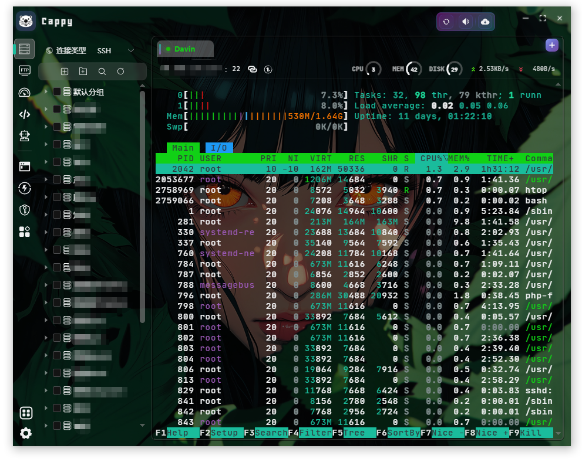

**FTP**

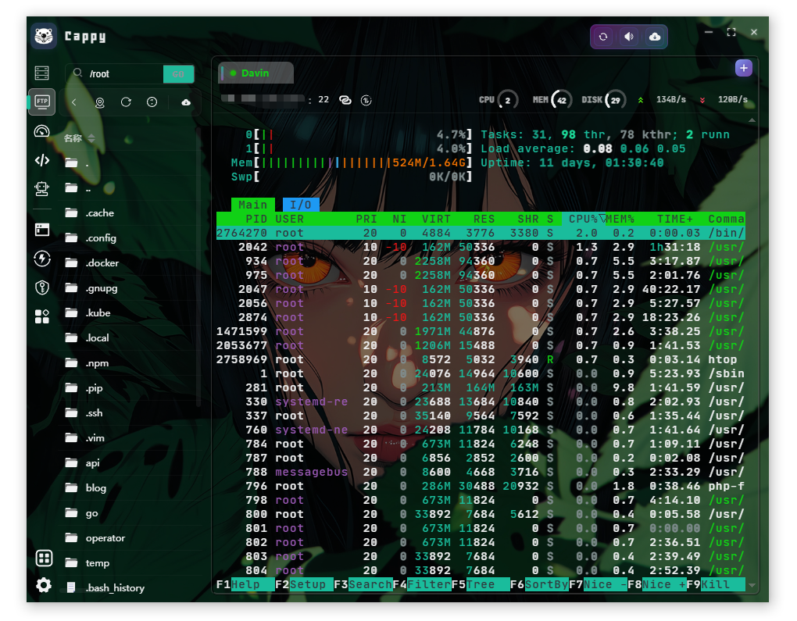

**监控仪表盘**

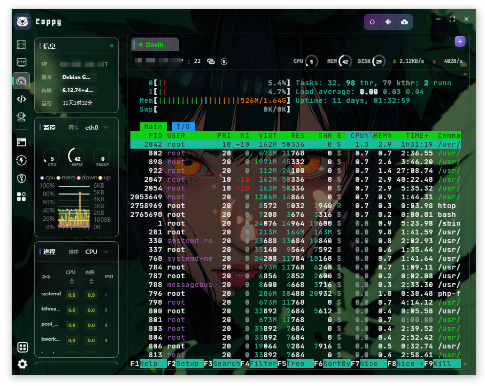

**快捷指令**

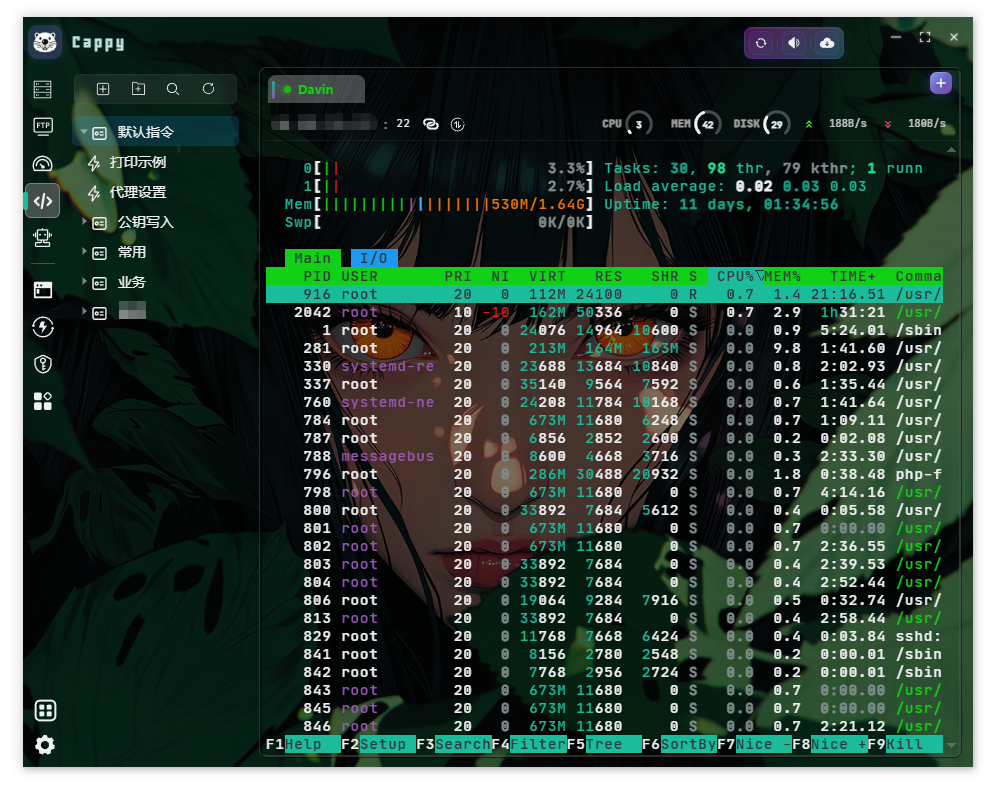

**分屏**

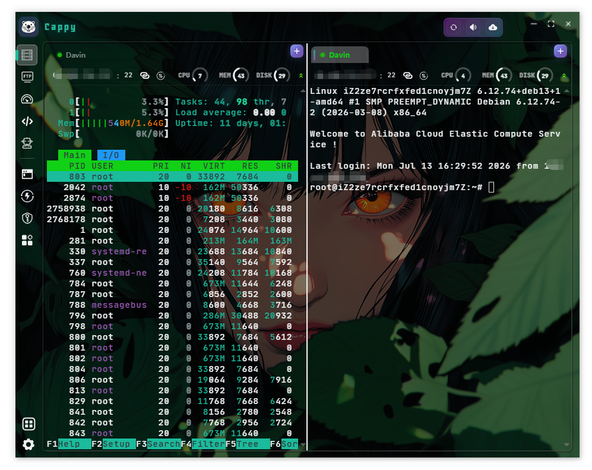

**AI（支持openai）**

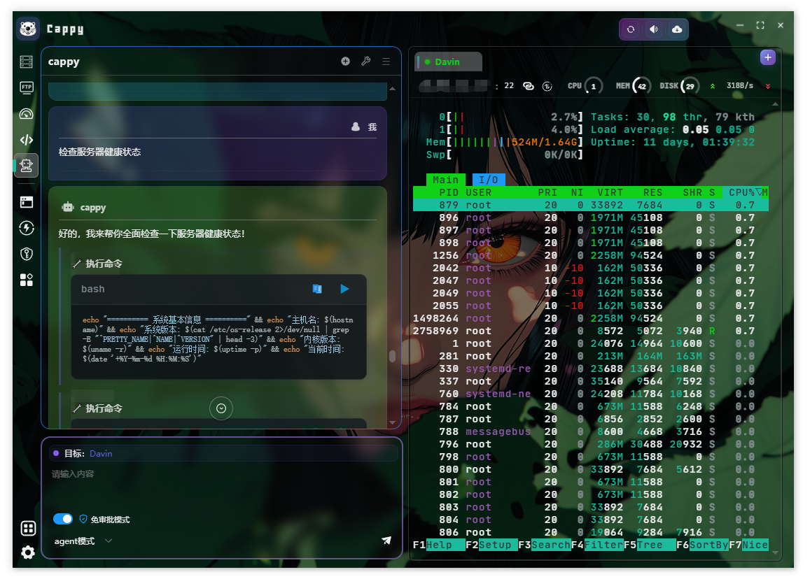

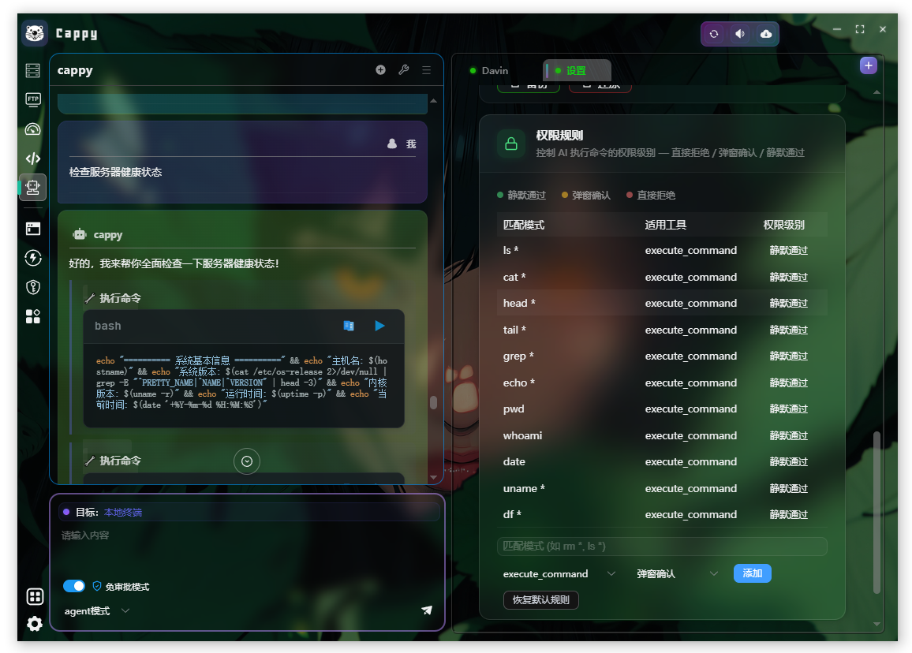

**进程网络监控**

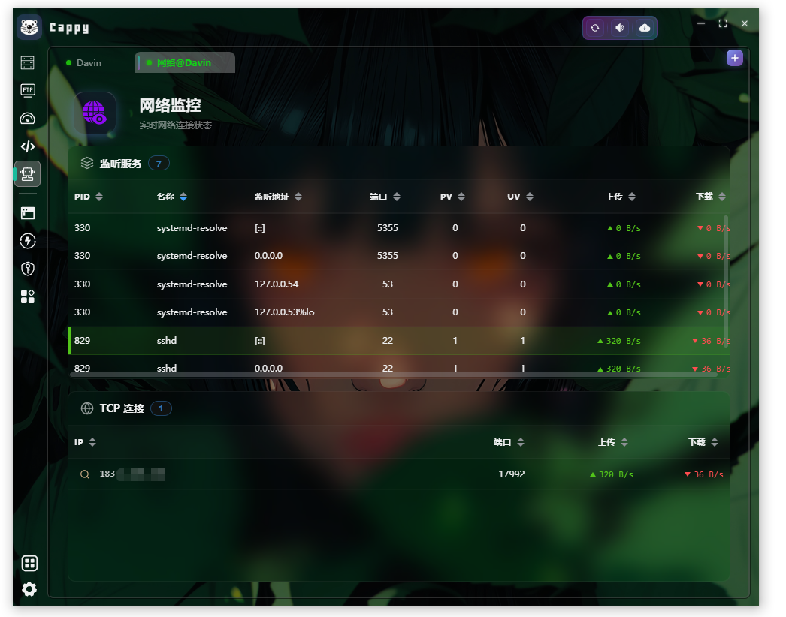

**背景图**

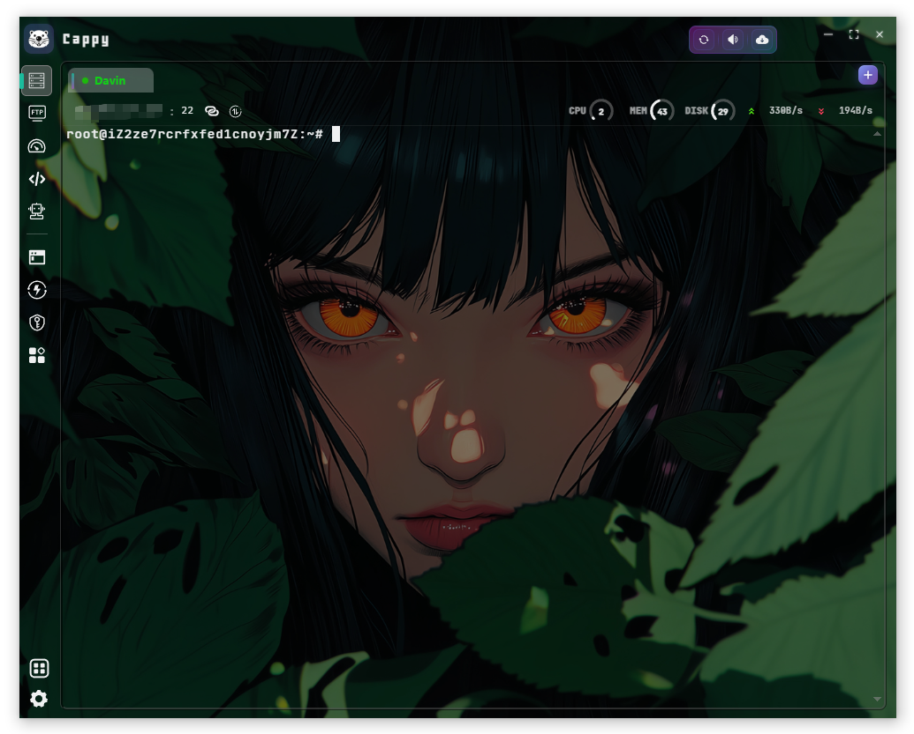

**内网穿透**

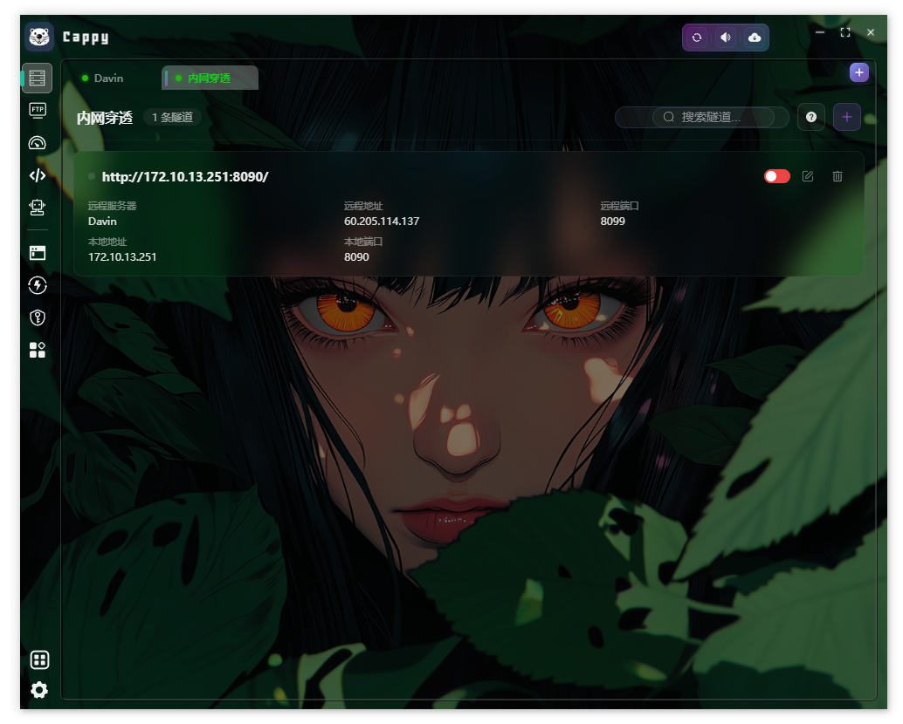

**docker镜像拉取**

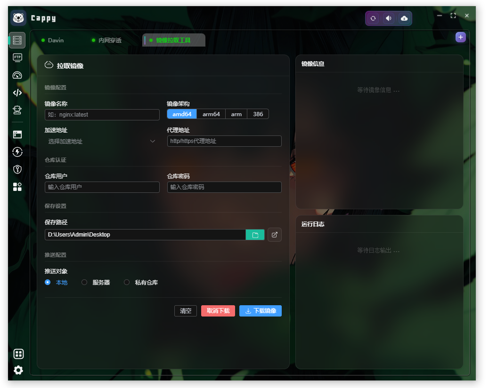

**QQ交流群**

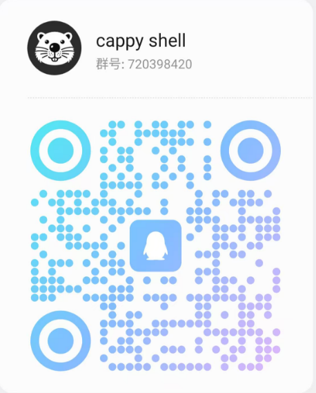