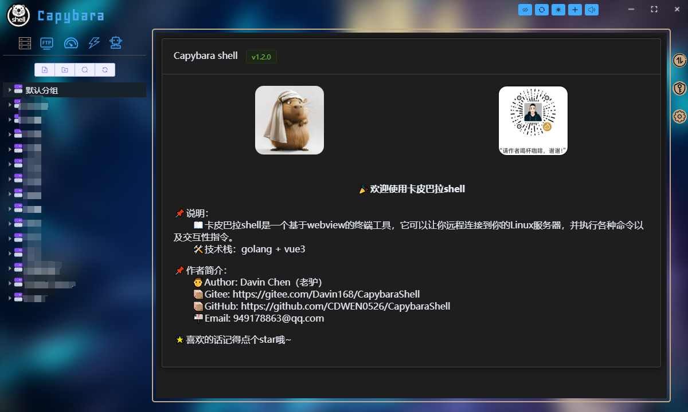
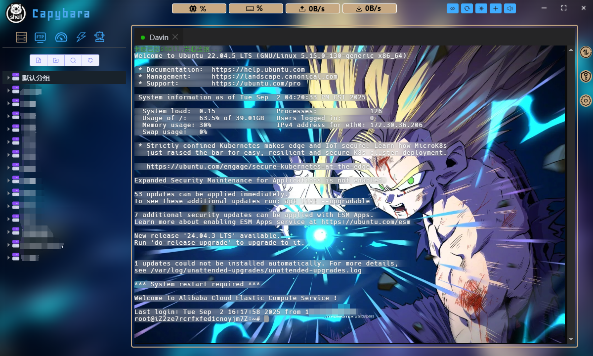
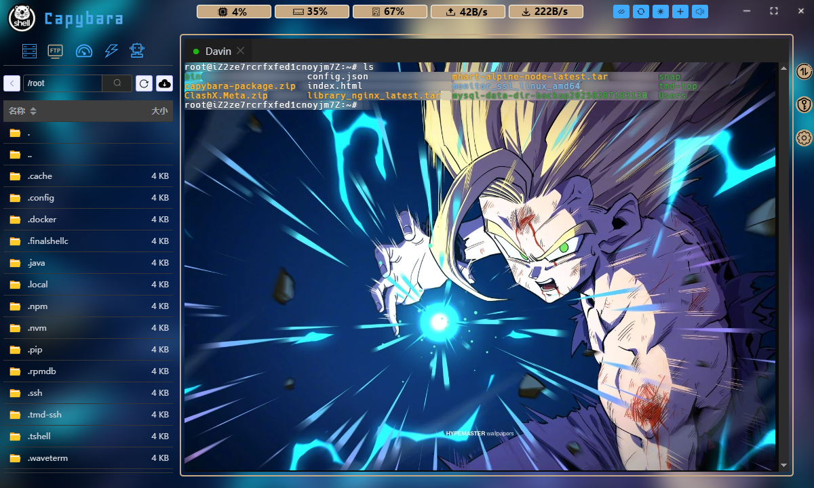
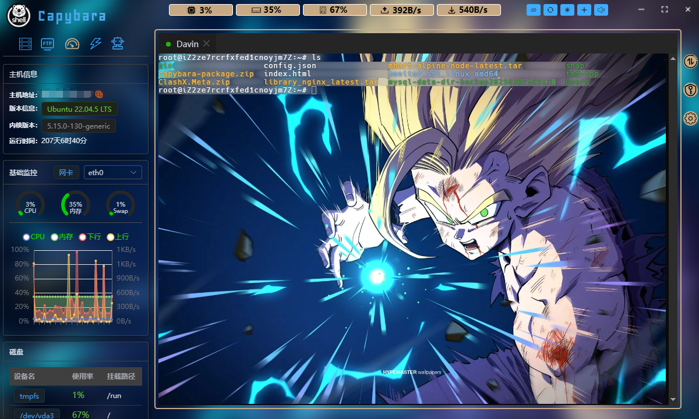
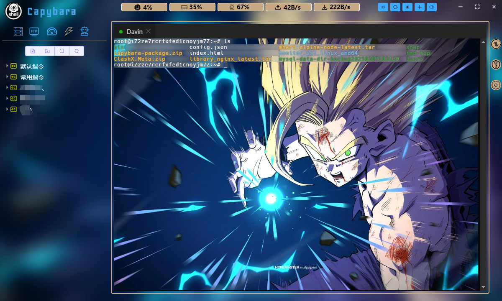
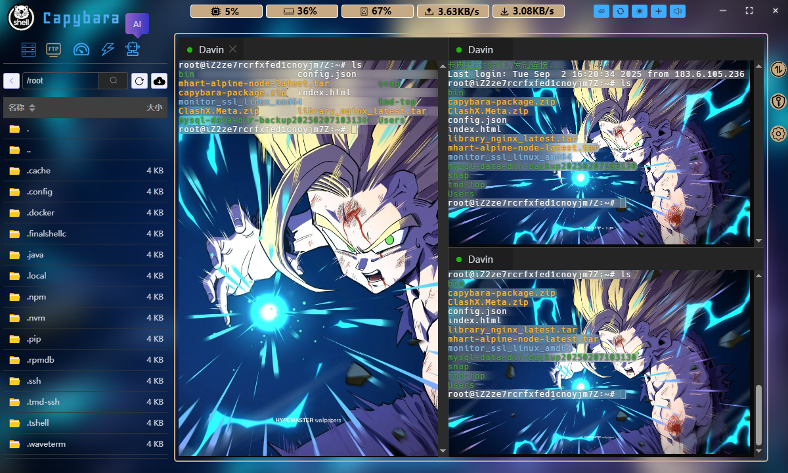
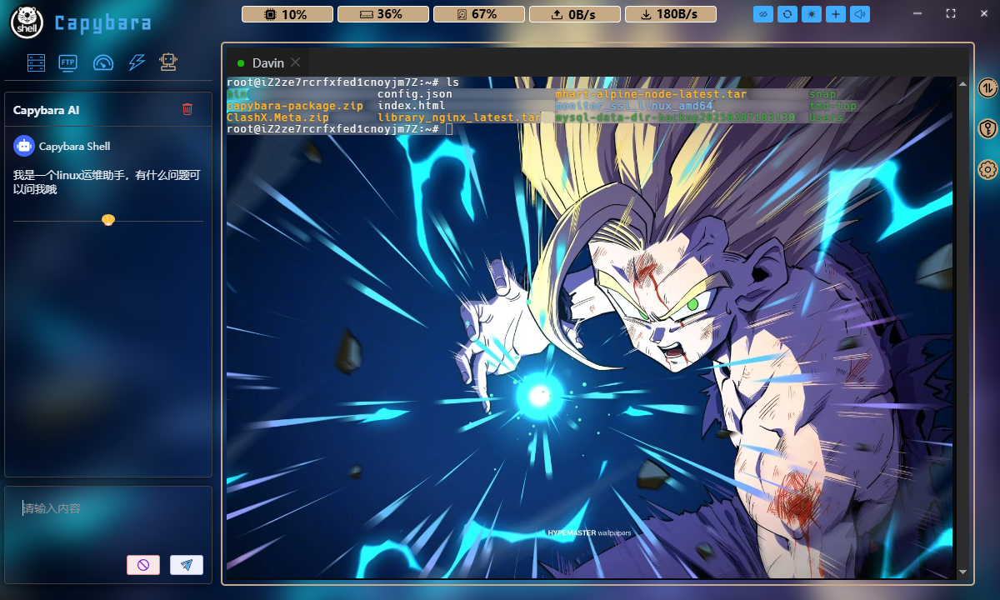
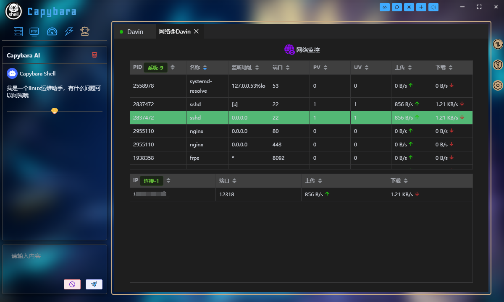

# Capybara Shell

#### 介绍
类似于finalshell，xshell之类的工具，ssh远程服务器管理工具，“卡皮巴拉shell”。

😁由于本人是运维仔，并且初尝Golang，写的不好多见谅，如有问题可以给我提issues，我有空就会看一下。

🤡目前只有windows版本，至于linux和mac版本后续会推出，目前没有mac电脑所以打包比较难。

😬目前暂不开源，等到基础功能完善好我再开源哦~

⭐️如果觉得好用的话，麻烦给我个免费的Star~

#### 技术栈
1、golang，wails
2、vue，element puls

#### 使用效果（下列演示设置了背景图，如不喜欢可以关闭背景图展示）

**首页**

**终端**

**FTP**

**监控仪表盘**

**快捷指令**

**分屏**

**AI（支持openai）**

**进程网络监控**

**交流群**

